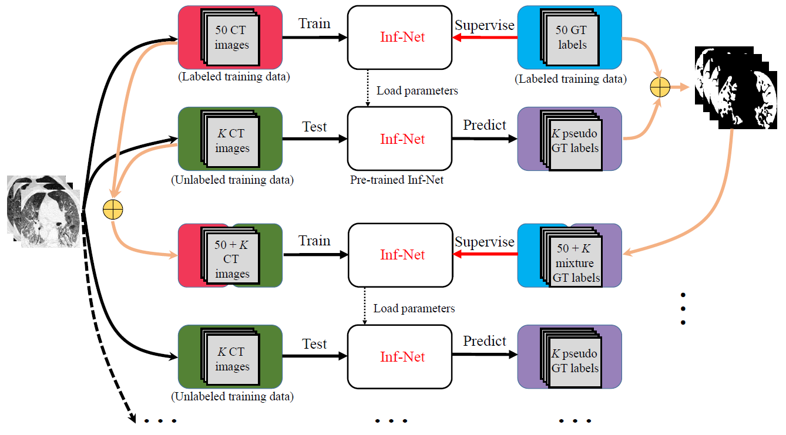
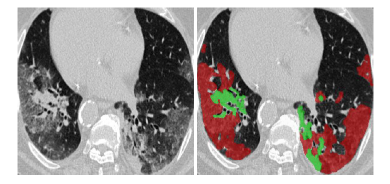
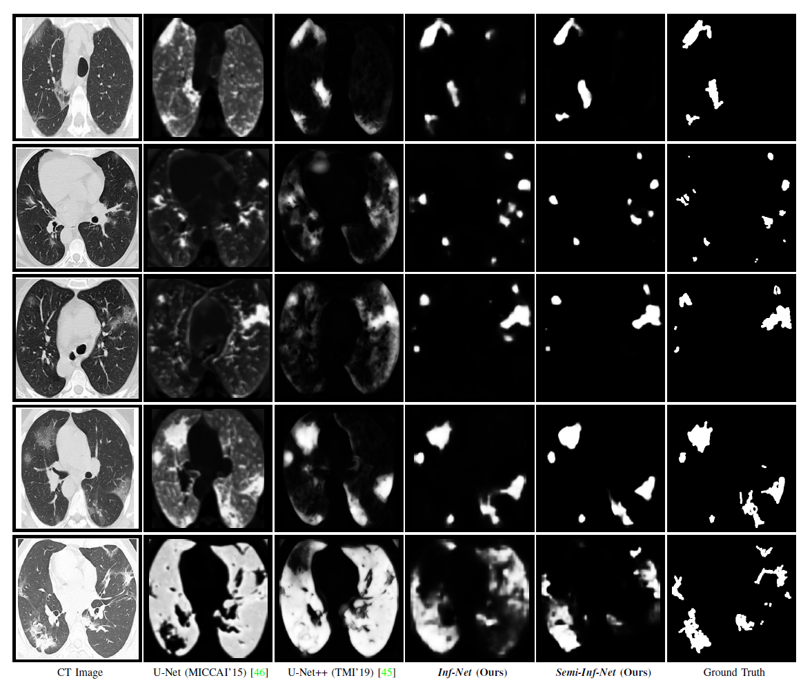
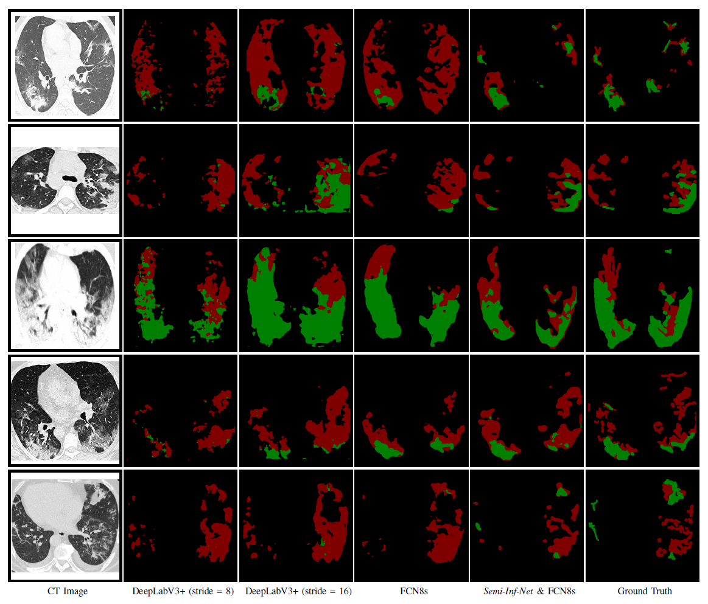

# Inf-Net
code for "Inf-Net: Automatic COVID-19 Lung Infection Segmentation from CT Scans" submit to TMI20.
 
Figure 1. The architecture of our proposed Inf-Net model, which consists of three reverse attention (RA) modules connected to the paralleled partial decoder (PPD).

## Semi-Inf-Net
 
Figure 2. Overview of the proposed Semi-supervised Inf-Net framework.

## Task Description
 
Figure 3. Example of COVID-19 infected regions in CT axial slice, where the red and green masks denote the ground-glass opacity (GGO) and consolidation,
respectively. The images are collected from [1].
[1] COVID-19 CT segmentation dataset, link: https://medicalsegmentation.com/covid19/, accessed: 2020-04-11.
## Pre-trained Model
coming soon

## Training set
coming soon

## Testing set
coming soon

## Results
 
Figure 4. Visual comparison of lung infection segmentation results.
 
Figure 5. Visual comparison of multi-class lung infection segmentation results, where the red and green labels indicate the GGO and consolidation, respectively.

## Paper list (update continue)
https://github.com/HzFu/COVID19_imaging_AI_paper_list

## Manuscript
http://dpfan.net/wp-content/uploads/2020TMISubmissionInfNet.pdf

## Citation
Please cite our paper if you find the work useful: 

	@article{fan2020InfNet,
  	title={Inf-Net: Automatic COVID-19 Lung Infection Segmentation from CT Scans},
  	author={Fan, Deng-Ping and Zhou, Tao and Ji, Ge-Peng and Zhou, Yi and Chen, Geng and Fu, Huazhu and Shen, Jianbing and Shao, Ling},
  	Journal = {arXiv},
  	year={2020}
	}
  
